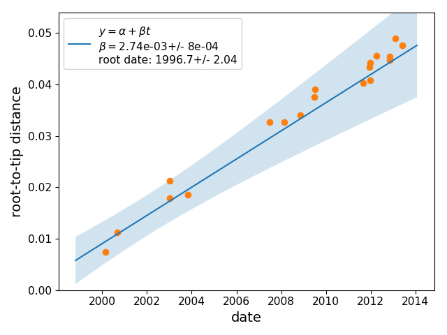

# Estimation of molecular clock models

Molecular clock estimation can be done via the command
```bash
treetime clock --tree data/h3n2_na/h3n2_na_20.nwk --dates data/h3n2_na/h3n2_na_20.metadata.csv --sequence-len 1400 --outdir clock_results
```
This command will print the following output:
```
 Root-Tip-Regression:
 --rate:  2.758e-03
 --chi^2: 10.65

 --r^2: 0.98

The R^2 value indicates the fraction of variation in
root-to-tip distance explained by the sampling times.
Higher values corresponds more clock-like behavior (max 1.0).

The rate is the slope of the best fit of the date to
the root-to-tip distance and provides an estimate of
the substitution rate. The rate needs to be positive!
Negative rates suggest an inappropriate root.


The estimated rate and tree correspond to a root date:


--root-date:   1996.72
```
and save a number of files to disk:
  * a rerooted tree in newick format
  * a table with the root-to-tip distances and the dates of all terminal nodes
  * a graph showing the regression of root-to-tip distances vs time



## Confidence intervals
In its default setting, `treetime clock` estimates confidence intervals of the evolutionary rate and the Tmrca by minimizing Chi-squared while accounting for covariation in root-to-tip distances.
However, this requires estimation of a timetree and can take a while.
For a quick estimate without confidence intervals, use `--reroot least-squares`.
When the branches of the tree are long, `--reroot chisq-rough` can be used instead of `--reroot chisq`.

