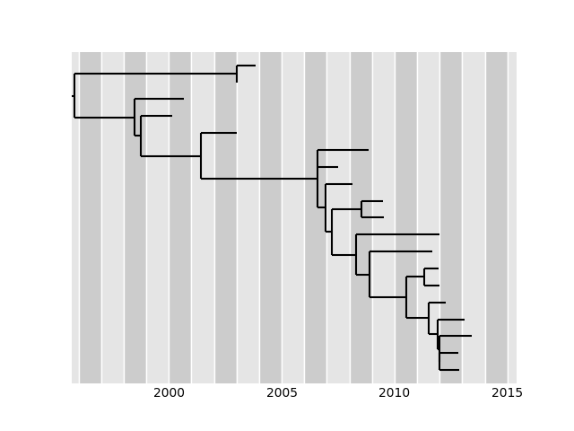
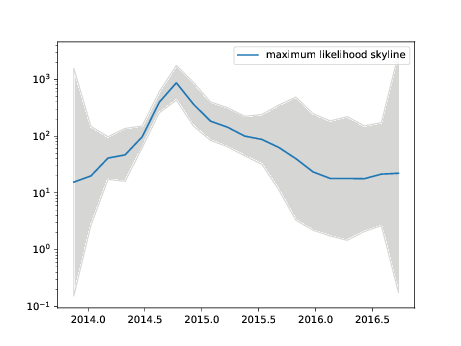

## Estimation of time scaled phylogenies

The principal functionality of TreeTime is estimating time trees from an initial tree topology, a set of date constraints (e.g. tip dates), and an alignment (optional)
```bash
treetime --tree data/h3n2_na/h3n2_na_20.nwk --dates data/h3n2_na/h3n2_na_20.metadata.csv --aln data/h3n2_na/h3n2_na_20.fasta --outdir h3n2_timetree
```
This command will estimate an GTR model, a molecular clock model, and a time-stamped phylogeny.
Most results are saved to file, but rate and GTR model are printed to the console:
```
Inferred GTR model:
Substitution rate (mu): 1.0

Equilibrium frequencies (pi_i):
  A: 0.2983
  C: 0.1986
  G: 0.2353
  T: 0.2579
  -: 0.01

Symmetrized rates from j->i (W_ij):
	A	C	G	T	-
  A	0	0.8273	2.8038	0.4525	1.031
  C	0.8273	0	0.5688	2.8435	1.0561
  G	2.8038	0.5688	0	0.6088	1.0462
  T	0.4525	2.8435	0.6088	0	1.0418
  -	1.031	1.0561	1.0462	1.0418	0

Actual rates from j->i (Q_ij):
	A	C	G	T	-
  A	0	0.2468	0.8363	0.135	0.3075
  C	0.1643	0	0.1129	0.5646	0.2097
  G	0.6597	0.1338	0	0.1432	0.2462
  T	0.1167	0.7332	0.157	0	0.2686
  -	0.0103	0.0106	0.0105	0.0104	0

Root-Tip-Regression:
 --rate:	2.613e-03
 --chi^2:	22.16

 --r^2:	0.98

--- saved tree as
	 h3n2_timetree/timetree.pdf

--- alignment including ancestral nodes saved as
	 h3n2_timetree/ancestral_sequences.fasta

--- saved divergence times in
	 h3n2_timetree/dates.tsv

--- tree saved in nexus format as
	 h3n2_timetree/timetree.nexus

--- root-to-tip plot saved to
	h3n2_timetree/root_to_tip_regression.pdf
```
The script saved an alignment with reconstructed ancestral sequences, an annotated tree in nexus format in which branch length correspond to years and mutations and node dates are added as comments to each node.
In addition, the root-to-tip vs time regression and the tree are drawn and saved to file.



### Fixed evolutionary rate
If the temporal signal in the data is weak and the clock rate can't be estimated confidently from the data, it is advisable to specify the rate explicitly.
This can be done using the argument
```
--clock-rate <rate>
```

### Specify or estimate coalescent models
TreeTime can be run either without a tree prior or with a Kingman coalescent tree prior.
The later is parameterized by a time scale 'Tc' which can vary in time.
This time scale is often called 'effective population size' Ne, but the appropriate Tc has very little to do with census population sizes.
To activate the Kingman Coalescent model in TreeTime, you need to add the flag
```
 --coalescent <arg>
```
where the argument is either a floating point number giving the time scale of coalescence in units of divergence, 'const' to have TreeTime estimate a constant merger rate, or 'skyline'.
In the latter case, TreeTime will estimate a piece-wise linear merger rate trajectory and save this in files ending on 'skyline.tsv' and 'skyline.pdf'

The following command will run TreeTime on the ebola example data set and estimate a time tree along with a skyline (this will take a few minutes).
```bash
treetime --tree data/ebola/ebola.nwk --dates data/ebola/ebola.metadata.csv --aln data/ebola/ebola.fasta --outdir ebola  --coalescent skyline
```



### Confidence intervals
In its default setting, `treetime` does not estimate confidence intervals of divergence times.
Such estimates require calculation of the marginal probability distributions of the dates of the internal nodes that take about 2-3 times as long as calculating only the jointly maximally likely dates.
To switch on confidence estimation, pass the flag `--confidence`.
TreeTime will run another round of marginal timetree reconstruction and determine the region that contains 90% of the marginal probability distribution of the node dates.
These intervals are drawn into the tree graph and written to the dates file.

### VCF files as input
In addition to standard fasta files, TreeTime can ingest sequence data in form of vcf files which is common for bacterial data sets where short reads are mapped against a reference and only variable sites are reported.
The following example with a set of MtB sequences uses a fixed evolutionary rate of 1e-7 per site and year.
```bash
treetime --aln data/tb/lee_2015.vcf.gz --vcf-reference data/tb/tb_ref.fasta --tree data/tb/lee_2015.nwk --clock-rate 1e-7 --dates data/tb/lee_2015.metadata.tsv
```
For many bacterial data set were the temporal signal in the data is weak, it is advisable to fix the rate of the molecular clock explicitly.
Divergence times, however, will depend on this choice.
